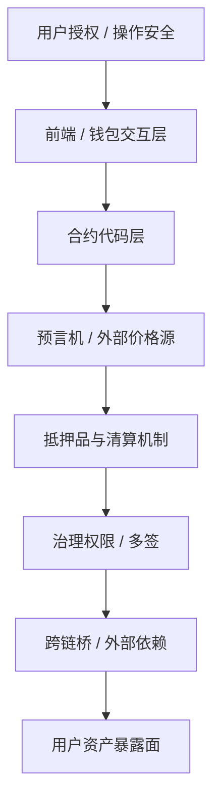

# 以太坊 / DeFi 风险结构指南

> 适用技能：SK-028、SK-029、SK-055
> 作用：把“智能合约漏洞、预言机、桥、权限、多签、授权”放进统一攻击面里看，不再把 DeFi 风险理解成单一代码 bug。

---

## 先建立总图

### 结构图：DeFi 攻击面分层

DeFi 风险不是一个点，而是一串层：

1. 合约代码
2. 价格预言机
3. 抵押品与清算机制
4. 治理与权限
5. 跨链桥与外部依赖
6. 用户自己的授权与操作安全

只盯“合约有没有 bug”，会漏掉大量真正常见的风险。

---

## 六类核心攻击面

| 风险层 | 典型问题 | 学习时最容易漏掉什么 |
|-------|---------|--------------------|
| 智能合约 | 重入、精度错误、权限缺陷 | 以为“审计过”就等于安全 |
| 预言机 | 价格操纵、延迟、单源依赖 | 忽略链下喂价与链上执行的时差 |
| 抵押与清算 | 清算门槛、折价、坏账扩散 | 只看抵押率，不看拥挤时的流动性 |
| 治理与权限 | 管理员密钥、升级权限、多签集中 | 把“去中心化”口号当成现实结构 |
| 跨链桥 | 托管人、验证器、消息伪造 | 忽略桥其实是额外信任假设 |
| 用户侧 | 恶意授权、钓鱼前端、假合约 | 把所有责任都归咎于协议本身 |

---

## 为什么 DeFi 风险常常是复合型

真实事故很少只有一个原因。

常见组合是：
- 预言机被操纵
- 合约按错误价格执行
- 清算链条把损失放大
- 用户再因错误授权或错误交互扩大暴露

因此学习时不要问“是哪一个 bug”，而要问：
- 哪一层先失效
- 它怎样把风险传给下一层

---

## SK-028 要掌握到什么程度

你不需要成为审计员，但至少能分清：
- 代码风险
- 机制风险
- 权限风险
- 用户操作风险

并能举出：
- 重入攻击
- 预言机操纵
- 恶意授权

这三类为什么不是同一种风险。

---

## SK-029：OpSec 基础怎么接进来

OpSec 不是“谨慎一点”。

它至少包括：
- 钱包隔离
- 授权最小化
- 不复用危险地址
- 避免签未知消息
- 区分合约交互风险与链下社工风险

换句话说：
协议再好，用户侧操作失误仍可直接把仓位送出去。

---

## 一张实用检查表

在与一个新协议交互前，至少检查：

1. 它依赖什么预言机？
2. 合约是否可升级？谁有升级权？
3. 多签是几签，签署人是否过度集中？
4. 是否依赖跨链桥、外部托管或单点做市？
5. 这次授权是否给了无限额度？
6. 如果最坏情况发生，我损失的是单笔仓位，还是整个钱包暴露面？

---

## 常见误判

### 误判一：有审计就安全

审计降低已知错误，不会消灭机制风险、治理风险和新型攻击。

### 误判二：链上公开就等于透明安全

公开只意味着可观察，不意味着普通用户能实时识别攻击面。

### 误判三：桥只是技术中转层

桥通常是新的信任假设和新的攻击面，不是“无害通道”。

---

## 完整正例：把一次协议风险拆成多层失效

场景：
- 某协议表面上“代码没被黑”，但价格预言机可被短时操纵。
- 攻击者借此抬高抵押品估值，套走真实资产。

正确拆法：

1. 第一层失效：预言机
   价格来源被操纵，不再可靠。
2. 第二层失效：合约执行
   合约没有坏，但它忠实执行了错误价格。
3. 第三层失效：清算与坏账
   协议按假价格放大了风险敞口。
4. 用户暴露面
   普通用户最终承受的是流动性和坏账扩散后的后果。

教学重点：
- DeFi 风险常常不是“某一层 alone”，而是层与层之间的传递
- “合约没 bug”不等于“系统没风险”

---

## 高压反例：不是协议被黑，而是你自己把权限送出去了

场景：
- 学习者使用一个假前端或恶意链接。
- 合约本身没问题，但他签了无限授权。
- 资产被转走后，第一反应是“协议漏洞”。

为什么这是高压反例：
- 真正先失效的是用户侧 OpSec，不是协议代码。
- 如果把所有损失都归因于“链上很危险”，就学不会分层定位。
- 这类案例最能暴露“把所有责任都扔给协议”的错误习惯。

---

## 练习题

### 题1：风险分层

把下面事件归类：
- 恶意授权
- 预言机操纵
- 管理员多签过度集中
- 跨链桥验证器失守

要求：
- 每一项都要对应到风险层

### 题2：为什么“有审计”不够

用不超过 3 句话解释，为什么审计不能覆盖治理、权限和外部依赖风险。

### 题3：交互前检查

你准备与一个新协议交互，必须先看哪 4 项？

---

## 评分点

学习者如果真正掌握本指南，回答里至少要出现：

1. `代码风险`、`机制风险`、`权限风险`、`用户风险` 的区分
2. 预言机和桥属于独立攻击面，不是“代码 bug”子类
3. OpSec 是独立风险层，不是附属提醒
4. 真实事故要按“哪一层先失效，怎样传到下一层”来拆

如果学习者只能背“重入攻击、预言机操纵、恶意授权”这些词，但无法分类，也无法说明传导顺序，则不应判为掌握。

---

## 学习输出要求

读完后，至少能独立回答：

1. DeFi 风险为什么不等于“智能合约代码风险”？
2. 预言机、权限、跨链桥分别属于哪一类脆弱点？
3. 为什么 OpSec 是协议风险之外的独立风险层？
4. 普通用户最应该优先规避的三种暴露面是什么？
