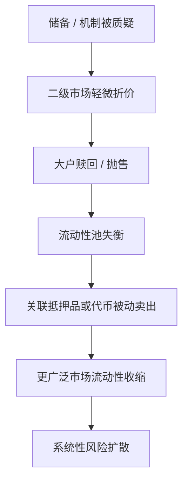

# 稳定币与流动性风险指南

> 适用技能：SK-019、SK-027、SK-028、SK-055
> 作用：补上稳定币不是“现金等价物”这一层理解，建立脱锚、赎回、流动性断裂和传导链的框架。

---

## 为什么这一层必须单独学

很多初学者把稳定币当成“加密版美元”。

这会直接导致两个危险误判：
- 把价格稳定误当成风险稳定
- 把链上流动性误当成可随时兑付的现金

稳定币真正要学的是它的风险结构，而不是它平时看起来有多稳定。

---

## 三种主类型

| 类型 | 典型机制 | 优点 | 核心脆弱点 |
|------|---------|------|-----------|
| 法币抵押型 | 以短债、现金、存款做储备 | 结构最直观 | 储备透明度、银行通道、监管冻结 |
| 加密抵押型 | 超额抵押链上资产 | 透明度高 | 抵押品波动、清算拥挤 |
| 算法型 | 靠铸销、激励、套利维持锚定 | 资本效率看似高 | 信心脆弱、死亡螺旋 |

---

## 真正要看的不是“锚没锚”

要看四个层面：

1. `储备能否兑现`
   资产是否真实存在，是否可变现。

2. `赎回通道是否畅通`
   即使理论上有储备，用户能否真的退出。

3. `二级市场流动性是否足够`
   大量卖盘来时，盘口能否承接。

4. `信心是否依赖继续上涨`
   如果系统需要“市场继续信它”才能活，那它通常并不稳。

---

## 风险传导链

### 结构图：稳定币风险扩散链

稳定币风险常见的传导顺序：

1. 市场开始质疑储备或机制
2. 二级市场价格先出现轻微折价
3. 大户加速赎回或抛售
4. 流动性池失衡
5. 相关抵押品或关联代币被同步抛售
6. 风险从单一代币传到整个市场

所以学习时必须问：
- 这个系统出问题后，第一层受伤的是谁？
- 第二层会被迫卖什么？
- 哪个环节会把局部问题扩散成系统问题？

---

## LUNA / UST 案例要抓什么

这个案例最重要的不是八卦，而是结构：

- UST 不是“有美元储备”的稳定币
- 它稳定的前提是套利机制持续有效
- 当信心反转时，赎回会把压力转移到 LUNA
- LUNA 下跌又反过来削弱 UST 支撑
- 于是进入正反馈死亡螺旋

换句话说：
它不是“偶然崩了”，而是风险结构在压力下显形。

---

## 和技能点的对应关系

### SK-027：CEX 破产风险

这里要把“稳定币风险”与“交易所托管风险”连起来：
- 用户资产并不等于立即可提的美元
- 平台流动性出问题时，稳定币也可能成为挤兑通道

### SK-028：DeFi 协议漏洞

很多 DeFi 风险事件最终都会体现到：
- 稳定币池失衡
- 抵押品折价
- 清算链条

### SK-055：LUNA 崩盘

核心不是背故事，而是能画出：
- 锚定机制
- 信心断裂点
- 压力如何层层传导

---

## 四个危险信号

1. 大额赎回依赖少数做市或少数通道
2. 稳定锚定依赖外部代币不断上涨
3. 流动性主要集中在单一池子或单一平台
4. 储备披露复杂、滞后或难以核验

---

## 完整正例：USDC 折价该怎么读

场景：
- 某法币抵押型稳定币因为银行风险传闻出现短时折价。
- 链上价格先脱离 1 美元，但发行方仍声称可按净值赎回。

正确拆法：

1. 先分层
   这是 `储备/银行通道风险`，不等于算法死亡螺旋。
2. 再看赎回通道
   若法币赎回仍可恢复，折价更像流动性和信心冲击，而不是结构彻底失效。
3. 再看二级市场承接
   若流动性池快速失衡，折价会先于事实被放大。

教学重点：
- 不是所有脱锚都是同一种风险
- 要先判断是“储备兑现问题”还是“机制自毁问题”

---

## 高压反例：暂时回稳，不等于结构安全

场景：
- 算法稳定币一度从深度折价拉回，看上去重新接近锚定。
- 学习者因此判断“风险已经过去”。

为什么这是危险误判：
- 价格短暂回稳不说明赎回链条已经恢复。
- 如果信心仍依赖外部代币继续上涨，结构脆弱点根本没消失。
- 学习者把“价格回稳”误判成“机制恢复”。

---

## 练习题

### 题1：先分类型

下面两类风险，哪一类更接近法币抵押型，哪一类更接近算法型？

- A：储备披露模糊，银行通道受限
- B：稳定依赖套利和外部代币市值支撑

### 题2：传导链

稳定币开始折价后，为什么风险会传到整个市场？

标准方向：
- 大户赎回或抛售
- 流动性池失衡
- 相关抵押品被动卖出
- 局部风险扩散成系统性压力

### 题3：LUNA 为什么不是“偶发事故”

要求：
- 必须回答锚定机制
- 必须回答信心断裂点
- 必须回答正反馈如何形成

---

## 评分点

学习者如果真正掌握本指南，回答里至少要出现：

1. `价格稳定` 不等于 `风险稳定`
2. 要区分 `储备问题`、`赎回问题`、`二级流动性问题`、`信心结构问题`
3. LUNA/UST 属于机制性脆弱，不是简单“有人砸盘”
4. 风险传导链必须能说出至少三层

如果学习者只能说“脱锚很危险”，但说不出：
- 为什么危险
- 危险先从哪一层开始
- 为什么会向外扩散

则说明还没真正掌握。

---

## 学习输出要求

读完后，至少要能独立回答：

1. 为什么“价格稳定”不等于“风险低”？
2. 法币抵押型、加密抵押型、算法型的核心脆弱点分别是什么？
3. 稳定币风险为什么会传导到整个市场？
4. LUNA / UST 的死亡螺旋是怎样形成的？
