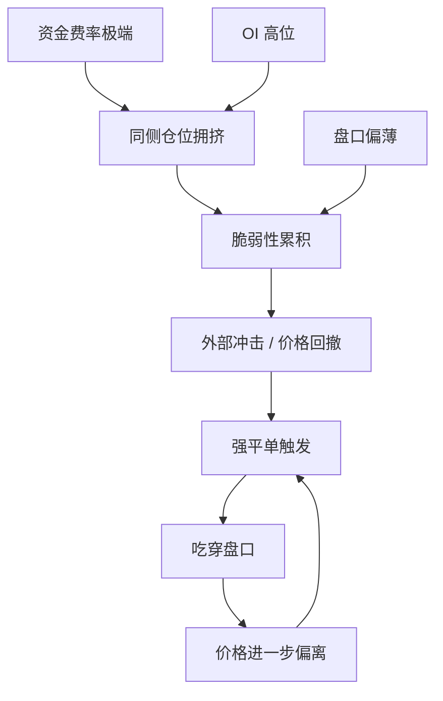

# 衍生品与资金费率指南

> 适用技能：SK-026、SK-043、SK-044、SK-056
> 作用：把“杠杆、永续、爆仓、资金费率、清算螺旋”放进同一张图里理解。

---

## 先抓主线

衍生品不是为了让你“放大收益”，它首先改变的是风险结构。

你真正要搞清楚的不是“多少倍杠杆更刺激”，而是：
- 风险什么时候被提前兑现
- 亏损什么时候从线性变成非线性
- 市场情绪什么时候会通过资金费率和 OI 积累成系统脆弱性

---

## 三种工具怎么区分

| 工具 | 成本结构 | 是否到期 | 最关键风险 |
|------|---------|---------|-----------|
| 现货 | 资金占用高，但无强平 | 无 | 机会成本、库存风险 |
| 永续合约 | 保证金占用低，靠资金费率锚定现货 | 无 | 强平、资金费率、标记价格偏移 |
| 交割合约 | 受基差和到期收敛影响 | 有 | 到期结构、基差波动、强平 |

最重要的不是背定义，而是理解：
- 现货主要承受方向风险
- 合约额外承受融资与清算机制风险

---

## 资金费率到底是什么

资金费率不是“手续费”，而是永续合约没有到期日后，用来把价格拉回现货锚的机制。

简化理解：
- 永续价格太高，多头付空头
- 永续价格太低，空头付多头

它告诉你的核心不是“多空谁赢”，而是：
- 哪一边在付持仓成本
- 市场拥挤在哪一边
- 情绪是否已经极端

---

## 资金费率该怎么读

### 正资金费率

常见含义：
- 多头更拥挤
- 做多需要持续付费
- 若价格继续涨，说明趋势很强
- 若价格不再涨，说明拥挤一侧开始脆弱

### 负资金费率

常见含义：
- 空头更拥挤
- 做空需要持续付费
- 若价格不再跌，空头回补可能触发反弹

### 极端资金费率

真正有价值的不是“正还是负”，而是：
- 是否已经偏离常态太多
- 偏离持续了多久
- 是否与 OI、价格结构、链上盈利状态共同指向拥挤

---

## 不能只看资金费率

资金费率必须和下面三项一起看：

1. `Open Interest`
   OI 高说明杠杆仓位总量高，不代表方向一定错，但代表脆弱性在累积。

2. `价格位置`
   同样是高资金费率，发生在突破初期和高位滞涨区，含义完全不同。

3. `清算机制`
   高杠杆、高 OI、薄盘口，才容易发展成清算螺旋。

---

## 爆仓为什么不是“亏完就结束”

### 结构图：拥挤到清算螺旋

爆仓机制会把私人损失变成市场流动性事件。

过程通常是：
1. 价格不利移动
2. 杠杆仓位逼近强平线
3. 强平单被动冲向市场
4. 盘口被吃穿
5. 更多仓位被触发强平
6. 价格进一步偏离

这就是为什么高杠杆环境下，波动会被自我放大。

---

## 对应技能点怎么落

### SK-026：爆仓机制

重点不是死记公式，而是知道：
- 爆仓线和止损线不是一回事
- 爆仓是被动退出
- 爆仓越近，策略越不像策略，越像赌价格路径

### SK-043：现货、永续、交割

本质是比较：
- 成本
- 风险暴露
- 时间结构

### SK-044：资金费率

必须能回答：
- 它锚定什么
- 正负各说明什么
- 为什么极端资金费率是情绪信号，不是单独的交易信号

### SK-056：闪崩案例

这里要把四件事连起来：
- OI 高位
- 资金费率极端
- 宏观冲击
- 微观结构脆弱

---

## 实战检查表

在用衍生品前，先问自己：

1. 我承担的是方向风险，还是融资/清算机制风险？
2. 这笔仓位若不利移动 3%-5%，我会先止损还是先被强平？
3. 当前资金费率是在告诉我“趋势强”，还是“仓位拥挤”？
4. OI 和盘口深度能不能承受突然的去杠杆？
5. 如果行情只是横住，资金费率会不会先把我耗死？

---

## 常见误判

### 误判一：正资金费率就是看多信号

不对。
它更准确地说是在告诉你，多头在为拥挤付费。

### 误判二：高杠杆只是把盈亏等比例放大

不对。
高杠杆会让你提前进入非线性风险区，因为清算不是线性退出。

### 误判三：爆仓只影响用了杠杆的人

不对。
强平单会冲击盘口，进而影响所有在场参与者。

---

## 完整正例：把拥挤读成风险，而不是热度

场景：
- BTC 连续上涨，永续资金费率持续高于常态。
- OI 处于阶段高位，但价格开始滞涨。
- 盘口深度没有跟着放大。

正确拆法：

1. 资金费率告诉你：多头在为拥挤付费
2. OI 告诉你：杠杆暴露面在累积
3. 价格位置告诉你：这不是突破初期，而更像高位拥挤区
4. 盘口告诉你：一旦去杠杆，承接能力有限

结论不是“立刻做空”，而是：
- 不能再把高资金费率简单理解成看多信号
- 必须开始防范清算链条和拥挤反噬

---

## 高压反例：方向对了，工具错了

场景：
- 学习者判断后市继续上涨，这个方向后来被市场验证。
- 但他用高杠杆永续追多，失效距离极短。
- 价格先回撤 4%，触发强平；随后市场再按原方向上涨。

为什么这是坏决策：
- 他承担的并不只是方向风险，还承担了融资和清算机制风险。
- 用永续高杠杆表达中期观点，本身就是工具错配。
- 这类失败不能归因为“市场太坏”，而是仓位和工具结构先错了。

---

## 练习题

### 题1：读资金费率

若资金费率持续极高，但价格已经不再创新高，这更像说明什么？

标准方向：
- 拥挤累积
- 多头在持续付费
- 若再无新增趋势推动，脆弱性上升

### 题2：现货 vs 永续

同样看多一段中期行情，为什么现货和高杠杆永续不是等价表达？

标准方向：
- 现货主要承受方向风险
- 永续额外承受资金费率、标记价格和强平风险

### 题3：清算螺旋怎么形成

用 4 步以内描述清算螺旋。

---

## 评分点

学习者如果真正掌握本指南，回答里至少要出现：

1. `资金费率是锚定机制，不是手续费`
2. `OI 代表杠杆脆弱性，不直接代表方向`
3. `工具选择先于方向判断`
4. `清算会把个体亏损变成市场流动性事件`

如果学习者只会说“高资金费率说明看多情绪强”，但说不出：
- 为什么这不等于单独交易信号
- 为什么还要看 OI、价格位置和盘口

则不应判定掌握。

---

## 学习输出要求

读完后，至少能独立回答：

1. 现货、永续、交割合约的核心区别是什么？
2. 资金费率的锚定逻辑是什么？
3. 为什么极端资金费率必须结合 OI 和价格位置看？
4. 为什么闪崩往往是“拥挤 + 杠杆 + 薄流动性”的共同结果？
