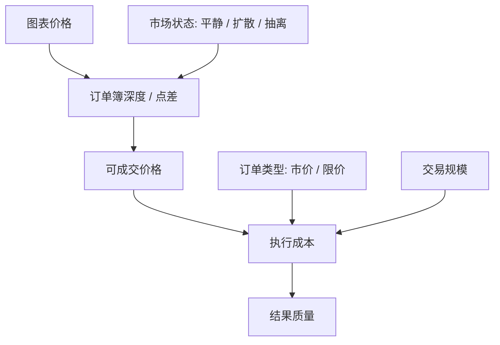

# 交易所微观结构指南

> 适用技能：SK-027、SK-043、SK-045、SK-050、SK-056
> 作用：补齐“看得见价格，看不见成交机制”这层盲点，帮助理解滑点、深度、爆量、闪崩和执行质量。

---

## 这份指南解决什么问题

很多交易错误不是方向错，而是把“图表上的价格”当成“你一定能成交的价格”。

在交易所里，价格只是撮合结果。真正决定你能否低成本成交的是：
- 买卖盘深度
- 点差
- 订单类型
- 你的单子相对市场深度有多大
- 流动性在关键时点是否蒸发

---

## 最小概念集

| 概念 | 一句话定义 | 学习时最容易犯的错 |
|------|-----------|------------------|
| 订单簿 | 当前买卖挂单的队列 | 把挂单量当成“绝对真实流动性” |
| Bid / Ask | 当前最高买价 / 最低卖价 | 只看中间价，不看实际成交边 |
| 点差 | Ask - Bid | 忽略点差成本，误以为进场价和出场价对称 |
| 深度 | 某个价位附近可成交的数量 | 不看深度，拿大单硬冲薄盘口 |
| 市价单 | 立刻成交，价格服从市场 | 把“快”误当成“便宜” |
| 限价单 | 价格优先，成交不保证 | 把“挂到了”误当成“成交了” |
| Maker / Taker | 提供流动性 / 吃掉流动性 | 只看手续费，不看冲击成本 |
| 滑点 | 预期成交价与实际成交价的差 | 把滑点只理解成手续费 |

---

## 你真正需要理解的三件事

### 结构图：价格、流动性与执行成本

### 1. 图表不是流动性

K 线只告诉你“已经发生的成交”，不告诉你“下一笔大单会穿透几层盘口”。

学习时要强制区分：
- `价格看起来在这里`
- `你真的能在这里成交`

### 2. 流动性是状态，不是常数

平时很深的盘口，在新闻冲击、爆仓链条、集中止损触发时会突然变薄。

所以：
- 平静行情里的滑点经验，不能直接外推到剧烈波动时
- 闪崩不是“价格突然疯了”，常常是“流动性突然没了”

### 3. 成交成本不只等于手续费

完整成本至少包括：
- 手续费
- 点差
- 滑点
- 大单对后续均价的冲击

很多“策略能赚钱”的错觉，都是因为回测只算了手续费，没算执行冲击。

---

## 对应到技能点怎么用

### SK-027：托管风险：CEX 破产的影响

这里要理解的不是图表，而是：
- 中心化交易所掌握资产和订单流
- 你看到的余额是平台数据库记账，不是链上托管隔离
- 平台出问题时，“能不能提现”比“屏幕上价格是多少”更重要

### SK-043：现货、永续合约、交割合约

要把“交易工具”与“成交机制”连起来看：
- 现货：看真实买卖盘和库存
- 永续：还要看标记价格、指数价格和清算机制
- 交割：再叠加到期结构和基差

### SK-045：流动性与滑点

这是本指南的直接落点：
- 市价单什么时候危险
- 限价单什么时候必须优先
- 为什么“仓位可接受”不等于“能低冲击成交”

### SK-056：2025年10月加密市场闪崩

要从“宏观冲击”继续下钻到：
- 订单簿是否抽空
- 爆仓单如何吃穿盘口
- 为什么表面跌幅会被成交机制放大

---

## 实操判断框架

下单前按这个顺序想：

1. 我是着急成交，还是着急控制价格？
2. 我的交易规模相对当前盘口深度有多大？
3. 当前行情是平静、扩散，还是流动性抽离？
4. 这笔单若触发连锁止损，会不会把自己变成“冲击来源”？
5. 如果成交一半，剩下一半怎么办？

---

## 三个常见误判

### 误判一：盘口很厚，所以一定安全

错在把挂单当成承诺。
真实市场里，流动性可以撤单，可以后退，也可以在冲击来时瞬间消失。

### 误判二：市价单只是多付一点手续费

错在忽略滑点和价格冲击。
当盘口很薄时，真正贵的不是手续费，而是你把自己一路吃上去或砸下去。

### 误判三：闪崩说明基本面突然全变了

很多时候先变的不是基本面，而是：
- 杠杆结构
- 强平链条
- 订单簿深度

也就是先变的是“市场 plumbing”。

---

## 完整正例：同样看多，为什么下单方式决定结果

场景：
- BTC 处于窄幅整理尾段，学习者准备做突破单。
- 可见盘口：上方 20 美元区间里挂单很薄，下方回踩承接略厚。

正确拆法：

1. 先判断目标
   这笔单更在意“价格控制”，不是“必须立刻成交”。
2. 再看盘口深度
   若直接市价追单，很可能把自己变成第一波冲击来源。
3. 设计下单方式
   先用小额试单确认突破是否真的能站住，再用限价单等待回踩承接。
4. 预设异常情况
   如果只成交一部分，剩余仓位不继续追高；如果突破失败，直接取消余单。

这个正例的重点是：
- 先分清“我急的是成交还是价格”
- 交易规模必须相对盘口深度去看，而不是只看账户大小

---

## 高压反例：方向判断正确，执行仍然失败

场景：
- 学习者判断闪崩后会反弹，方向本身没错。
- 但他在流动性抽空阶段直接用大额市价单抄底。
- 结果反弹真的发生了，可实际成交均价远高于预期，风险收益结构被严重破坏。

为什么这是坏执行：
- 学习者把“判断方向”误当成“成交一定便宜”。
- 在盘口极薄时，大额市价单会主动吃穿挂单，自己制造更差的成交。
- 即便方向最终对了，执行质量仍然低。

教学上要抓住：
- 方向正确不等于执行正确
- 低流动性时，订单类型本身就是风险变量

---

## 练习题

### 题1：市价还是限价

给定条件：
- 买卖盘点差快速扩大
- 你准备成交的数量接近上方两档挂单总量

问：
- 这时为什么不能直接把“市价单更快”当成唯一理由？

标准方向：
- 因为真正成本来自点差、滑点和冲击，而不只是速度

### 题2：解释“价格不是流动性”

用不超过 3 句话解释：
- 为什么图表显示的最新价，不等于你能大额成交的价格？

### 题3：闪崩时先看什么

遇到快速下跌时，先看哪三项？

标准方向：
- 盘口深度是否抽空
- 强平/止损链条是否在触发
- 交易规模相对当前流动性的冲击会不会失控

---

## 评分点

学习者如果真正掌握本指南，回答里至少要出现：

1. `价格` 和 `可成交价格` 的区别
2. `流动性是状态，不是常数`
3. `市价单的成本 = 手续费 + 点差 + 滑点 + 冲击`
4. `执行方式必须随盘口状态变化`

如果学习者只会说“闪崩很危险”，但说不出：
- 为什么危险
- 危险来自哪一层
- 如何调整订单类型

则说明还没掌握微观结构。

---

## 学习输出要求

读完本指南后，至少应该能独立回答：

1. 为什么“看到价格”不等于“能按这个价格成交”？
2. 为什么滑点是执行问题，不只是手续费问题？
3. 为什么同样的交易规模，在平静时和闪崩时成本完全不同？
4. 为什么微观结构能放大原本有限的宏观冲击？
